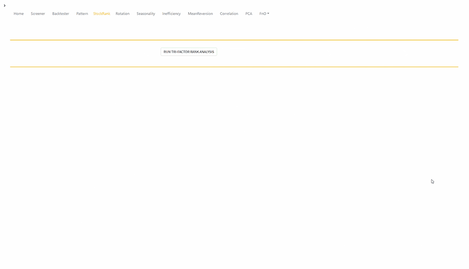
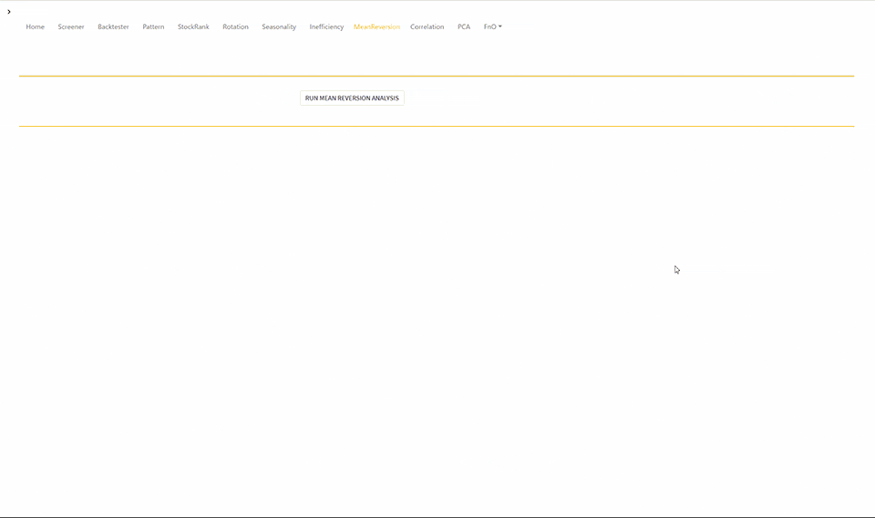

# Finance Quantitative Statistical Analysis Platform  
<b>Online software platform for investment analytics to make informed decisions  when comparing and analyzing portfolio components. The suite of quantitative tools covers portfolio modeling and backtesting, portfolio optimization, factor models, tactical asset allocation models, market inefficiencies, seasonality studies, correlation and regression analyses. </b>  

<b>SHOWCASE GIFS</b>  

<b>1. Home Page:</b>

  

<b>2. MultiFactor Screener:</b>

  

<b>3. MultiFactor Backtester:</b>

  

<b>4. Patterns Analyzer:</b>

  

<b>5. TriFactor Rank Analysis:</b>

  

<b>6. Rotation Analysis:</b>

  

<b>7. Seasonality Analysis:</b>

  

<b>8. Mean Reversion  Analysis:</b>

  

<b>9. Pair Plotting  Analysis:</b>

  
